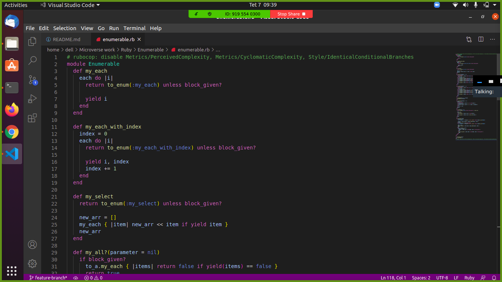

# Enumerable

> This is the second Project in Ruby Course.
Here we have, Ruby implementation of different methods to duplicate the functionality of enumerable class methods.



## Built With

- Ruby Programming Language.


## Getting Started

**To get this project set up on your local machine, follow these simple steps:**

1. Open Terminal.

2. Navigate to your desired location to download the contents of this repository.

3. Copy and paste the following code into the Terminal:


   ``` https://github.com/Yors-git/Enumerable.git```

4. Hit enter.

5. Enjoy!

6. Hint: Our project uses Gemfile to install gems


## Authors

👤 **Gzim Asani**

- Github: [@GzimAsani](https://github.com/GzimAsani)
- Linkedin: [Gzim Asani](https://www.linkedin.com/in/gzim-asani-83390a17a/)

👤 **Jorge Torres**

- Github: [@Yors-git ](https://github.com/Yors-git)
- Twitter: [@Yors_82](https://twitter.com/Yors_82)
- LinkedIn: [Jorge Torres](https://www.linkedin.com/in/jorge-torres-8b87571a8/)

## 🤝 Contributing

Contributions, issues and feature requests are welcome!

Feel free to check the [issues page](issues/).

## Show your support

Give a ⭐️ if you like this project!

## Acknowledgments

- Hat tip to anyone whose code was used
- Inspiration
- etc

## 📝 License

This project is [MIT](lic.url) licensed.
